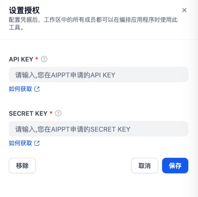

## AiPPT.cn

## Overview

AiPPT.cn is an intelligent online tool for generating presentation slides.
Created by a professional design team, it offers a vast library of high-quality templates. Simply enter a title to effortlessly generate a complete PPT. AiPPT.cn's core capabilities are open and available through multiple integration options, catering to various business scenarios.
Dedicated customer support ensures fast onboarding and seamless usage, with continuous product updates. One-time integration, long-term peace of mind.

## Configure

### 1. Apply for AiPPT.cn API Key

Please apply for an API Key on the [AiPPT.cn Open Platform](https://open.aippt.cn/).

### 2. Get AiPPT.cn tools from Plugin Marketplace

The AiPPT.cn tools could be found at the Plugin Marketplace, please install it first.

### 3. Fill in the configuration in Dify

On the Dify navigation page, click `Tools > AiPPT.cn > Authorize` and fill in the API KEY and SECRET KEY.

### 4. The AIPPT tool includes the following functions:

#### Generate Outline

Simply enter a title to instantly generate a PPT.

#### Generated Content

Generate content using the provided outline.

#### Template List

Select a PPT template

#### Generate Design

Provide you with the download link for your design.

### 5. Use the tool

You can use the AiPPT.cn tool in the following application types:

#### Chatflow / Workflow applications

Both Chatflow and Workflow applications support adding a AiPPT.cn tool node.

#### Agent applications

This tool is currently not supported in Agent applications.